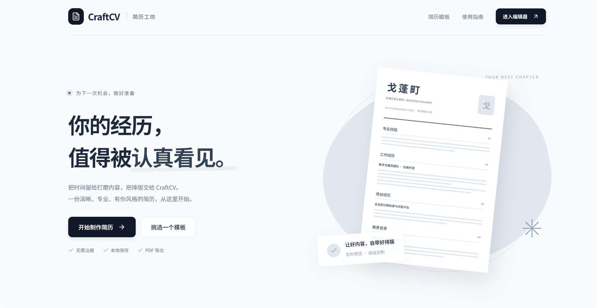

# CraftCV

[简体中文](README.zh-CN.md) | English

CraftCV is a browser-based resume editor for writing, previewing, and exporting a polished resume without an account.



## What it does

- Start from the home page or open `#/editor` directly.
- Edit profile, education, skills, work experience, projects, and achievements with a live A4 preview.
- Choose between Classic and Minimal layouts while preserving your content.
- Upload and crop an avatar, adjust typography and colors, and export through the browser print dialog.
- Undo or redo recent edits, then import or export a JSON backup.

## Data and privacy

Resume data stays in the current browser's `localStorage`; CraftCV does not provide an account or server-side storage. Export a JSON backup before clearing browser data or moving to another device.

The bundled resume is an anonymized example for layout reference. Older built-in demo caches are migrated to the current anonymous example on load.

## Run locally

```bash
npm install
npm run dev
```

Open the URL printed by Vite. For a production build:

```bash
npm run build
npm run preview
```

## Validation

```bash
npm run lint
npm test
npm run build
```

## Stack

React 19 · TypeScript · Vite · Tailwind CSS v4 · Motion

## License

[MIT](LICENSE)
